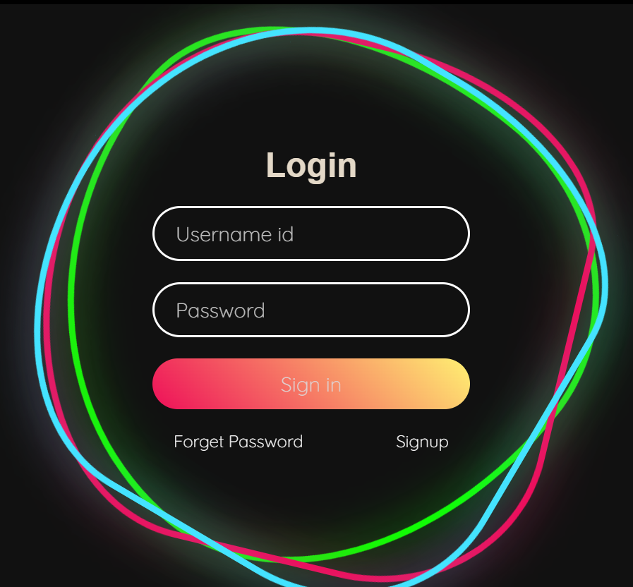

# 🔐 Animated Login Page  

  

## 📌 Overview  
The **Animated Login Page** is a beautifully designed login form with smooth animations and an interactive UI. It enhances the user experience with engaging effects while maintaining a clean and responsive layout.  

## ✨ Features  
- 🎨 **Attractive UI**: Modern and sleek design.  
- 🖥️ **Fully Responsive**: Works on all screen sizes.  
- 🔄 **Smooth Animations**: Eye-catching transitions and effects.  
- 🔐 **Secure Input Fields**: Password field with visibility toggle.  

## 🚀 Technologies Used  
- **HTML** - Structure of the login page.  
- **CSS** - Styling, animations, and responsiveness.  
- **JavaScript** - Dynamic form interactions.  

## 📂 Project Structure  
📁 animated_login_page

├── 📜 index.html # Login page structure

├── 🎨 style.css # Styling and animations

├── 🛠️ script.js # JavaScript for interactivity

├── 🖼️ bg_image.jpg # Background image

├── 🖼️ logo.png # Logo image

├── 📜 README.md # Project documentation

## 🔧 Setup & Usage  
1. Clone the repository:  
   ```bash
   git clone https://github.com/Shivam0400/animated_login_page.git
2. Open index.html in any web browser.
3. Enter login details and experience the animation effects.
   
## 🎯 Future Enhancements
🌓 Dark Mode Support for better accessibility.
🔄 Remember Me Functionality for saving user login details.
🔗 Backend Integration to handle real authentication.

## 💡 Contribution
Feel free to fork this repository, raise issues, and submit pull requests.

## 🚀 A stylish and engaging login page for modern web applications!


### Steps to Add:  
1. Create a `README.md` file in your repository (if not already present).  
2. Copy and paste the above content into it.  
3. Commit and push the changes to GitHub.  

Let me know if you need any changes! 😊🔥


